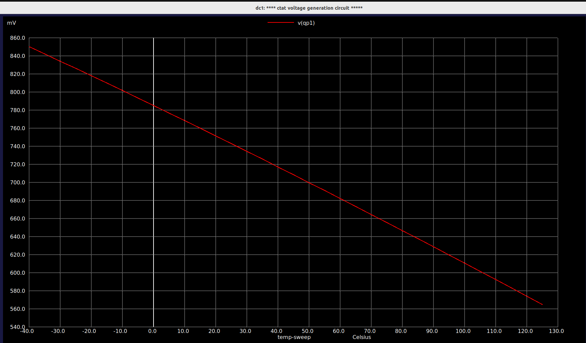
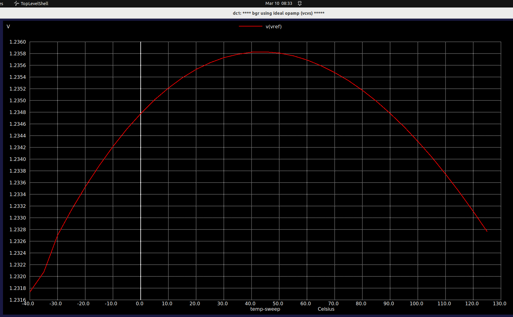
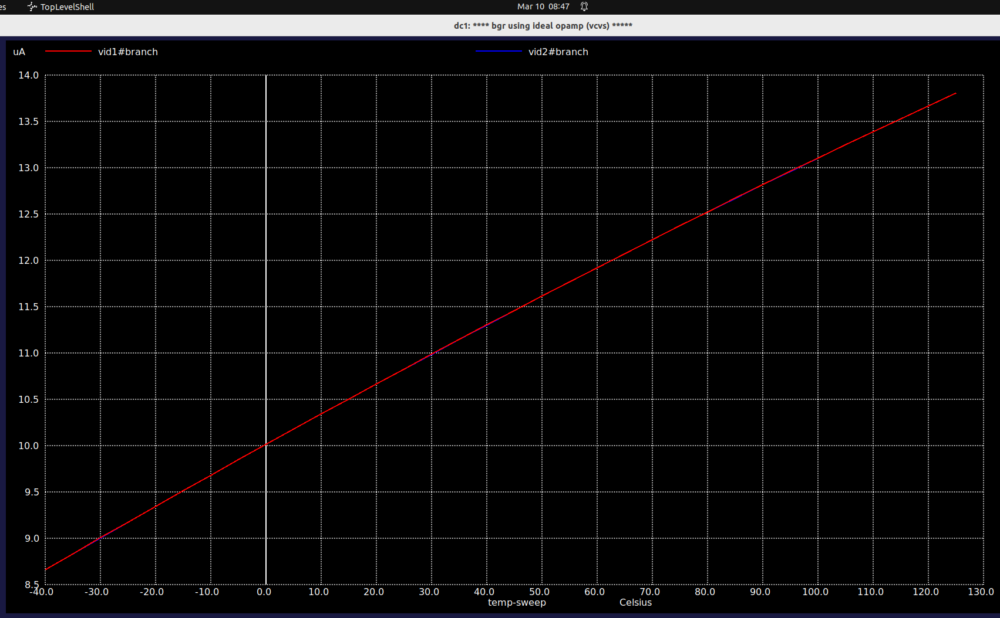
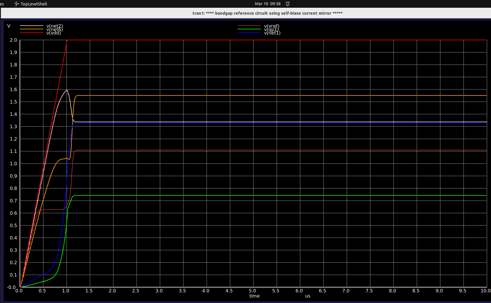
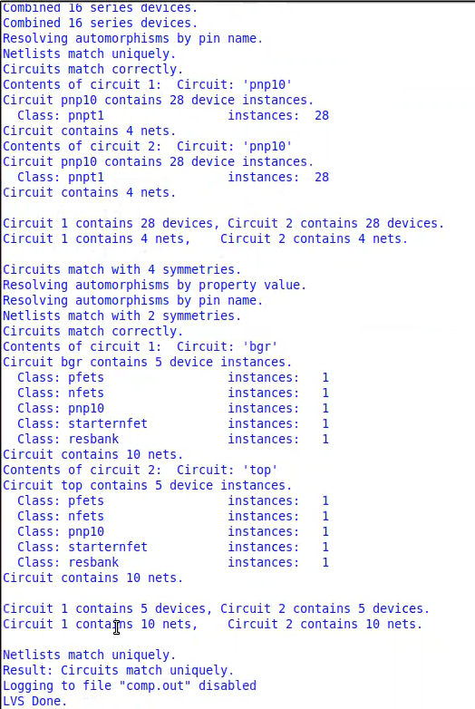

# Bandgap Reference (BGR) Circuit Design — Sky130 PDK

> A complete bottom-up design and simulation of a **1.2 V Bandgap Reference** circuit using the **SkyWater Sky130 PDK**, implemented and verified in **Xschem + ngspice**. The design covers the full IC design flow: first-principles derivation → schematic → simulation → layout → LVS.

---

## Table of Contents

1. [Project Overview](#1-project-overview)
2. [Design Flow](#2-design-flow)
3. [Theory & Design Equations](#3-theory--design-equations)
   - [3.1 CTAT Voltage](#31-ctat-voltage)
   - [3.2 PTAT Voltage](#32-ptat-voltage)
   - [3.3 CTAT + PTAT Cancellation](#33-ctat--ptat-cancellation)
   - [3.4 Self-Biased Current Mirror (SBCM)](#34-self-biased-current-mirror-sbcm)
   - [3.5 Startup Circuit](#35-startup-circuit)
4. [Simulation Results](#4-simulation-results)
   - [4.1 CTAT Characterization](#41-ctat-characterization)
   - [4.2 PTAT Characterization](#42-ptat-characterization)
   - [4.3 Ideal BGR (VCVS Op-Amp)](#43-ideal-bgr-vcvs-op-amp)
   - [4.4 Complete BGR with SBCM](#44-complete-bgr-with-sbcm)
   - [4.5 Startup Circuit Analysis](#45-startup-circuit-analysis)
   - [4.6 Process Corner Verification](#46-process-corner-verification)
5. [Layout](#5-layout)
6. [LVS Check](#6-lvs-check)
7. [Key Results Summary](#7-key-results-summary)
8. [Tools & PDK](#8-tools--pdk)
9. [Repository Structure](#9-repository-structure)

---

## 1. Project Overview

A **Bandgap Reference (BGR)** generates a stable DC voltage that is independent of temperature, supply voltage, and process variations. This project implements a classic Widlar-style BGR targeting **VREF ≈ 1.2 V** — the silicon bandgap energy (~1.205 eV at 0 K) — by precisely cancelling the opposing temperature coefficients of two fundamental quantities in a BJT:

| Signal | Temperature behaviour | Source |
|--------|----------------------|--------|
| V_BE   | Decreases ~−2 mV/°C  | Single BJT diode (CTAT) |
| ΔV_BE  | Increases with T      | Differential V_BE of two BJTs at different current densities (PTAT) |

When scaled and summed, the two slopes cancel to give a near-zero Tempco output.

---

## 2. Design Flow

```
CTAT characterization
        ↓
PTAT characterization
        ↓
Ideal BGR (VCVS op-amp) — concept validation
        ↓
Complete BGR (Self-Biased Current Mirror)
        ↓
Startup circuit design & transient verification
        ↓
Process corner verification (FF / TT / SS)
        ↓
Physical Layout (Magic VLSI)
        ↓
LVS Check (Netgen)
```

---

## 3. Theory & Design Equations

### 3.1 CTAT Voltage

The base-emitter voltage of a BJT follows the diode equation:

```
V_BE = (kT/q) × ln(I_C / I_S)
```

Where `I_S` is the saturation current, which itself increases with temperature as `T^4` due to carrier mobility degradation and the temperature dependence of the intrinsic carrier concentration `ni`. The net result is that **V_BE decreases approximately linearly with temperature** — this is the **CTAT** (Complementary To Absolute Temperature) characteristic.

At room temperature (T = 300 K):
```
dV_BE/dT ≈ −2 mV/°C
```

For this design, a **PNP BJT** (Sky130 `sky130_fd_pr__pnp_05v5_W3p40L3p40`) is used with its emitter tied to VDD and collector/base tied to ground — acting as a diode-connected BJT. V_BE is measured at node `v(qp1)`.

### 3.2 PTAT Voltage

When two BJTs operate at different current densities (ratio N), their differential base-emitter voltage is:

```
ΔV_BE = V_BE1 − V_BE2 = V_T × ln(N)
```

Where `V_T = kT/q` is the thermal voltage (~26 mV at 300 K). Since `V_T ∝ T`, **ΔV_BE increases linearly with temperature** — this is the **PTAT** (Proportional To Absolute Temperature) characteristic.

```
d(ΔV_BE)/dT = (k/q) × ln(N) ≈ +0.085 mV/°C  (for N = 8)
```

The PTAT voltage is developed across a resistor R1:
```
I_PTAT = ΔV_BE / R1 = V_T × ln(N) / R1
V_PTAT (across R2) = R2 × I_PTAT = (R2/R1) × V_T × ln(N)
```

### 3.3 CTAT + PTAT Cancellation

The reference voltage is the sum:
```
V_REF = V_BE + (R2/R1) × V_T × ln(N)
```

For zero temperature coefficient:
```
dV_REF/dT = 0
⟹ dV_BE/dT + (R2/R1) × ln(N) × (k/q) = 0
⟹ R2/R1 = |dV_BE/dT| / [ln(N) × k/q]
         = 2 mV/°C / [ln(8) × 0.0857 mV/°C]
         ≈ 8
```

The resulting reference voltage converges to the silicon bandgap extrapolated to 0 K:
```
V_REF ≈ V_G0 ≈ 1.205 V
```

### 3.4 Self-Biased Current Mirror (SBCM)

In the complete design, the ideal op-amp is replaced with a **Self-Biased Current Mirror (SBCM)** using PMOS transistors. The SBCM forces the voltages at Vid1 and Vid2 (the two BJT emitter nodes) to be equal, replicating the function of the op-amp's virtual short.

**The zero-current degenerate bias problem:** The SBCM has a stable operating point at zero current (all transistors off). This is because the feedback loop that sets the operating point requires current to already be flowing — it cannot self-start from zero.

**Verification:** `BGR_Vid1_Vid2_same.png` confirms Vid1 = Vid2 (virtual short achieved) and `Vid1_Vid2_current_same.png` confirms equal branch currents once the circuit is biased correctly.

### 3.5 Startup Circuit

To kick the circuit out of the zero-current degenerate state, a **startup circuit** is used:

**Phase 1 — Kick at power-on:**  
At t=0, VDD ramps up. The startup circuit detects the zero-current state and injects a small current into one of the SBCM nodes, breaking the degeneracy and forcing the circuit toward its intended operating point.

**Phase 2 — Auto turn-off:**  
Once V_REF reaches its correct value (~1.2 V), a feedback path within the startup circuit detects this and shuts itself off, preventing it from disturbing the reference in steady state.

The transient analysis (`BGR_startup_transient_analysis.png`) shows the circuit settling cleanly to V_REF within ~1 μs.

---

## 4. Simulation Results

### 4.1 CTAT Characterization

> **Folder:** `simulations/01_CTAT/`

| Screenshot | Description |
|------------|-------------|
| `CTAT_Single_1.png` | Single PNP BJT diode-connected, showing V_BE vs temperature |
| `CTAT_Mul_1.png` | Multiple BJT configuration exploration |
| `CTAT_Graph.png` | **V_BE temperature sweep (−40°C to +125°C)** — clean linear CTAT characteristic, ~848 mV at −40°C falling to ~560 mV at +125°C |
| `CTAT_slope.png` | Slope extraction confirming ~−2 mV/°C |
| `CTAT_variable_current.png` | CTAT behaviour across different bias current values |

**Key result:** `CTAT_Graph.png`



---

### 4.2 PTAT Characterization

> **Folder:** `simulations/02_PTAT/`

| Screenshot | Description |
|------------|-------------|
| `PTAT_Graph.png` | ΔV_BE vs temperature — positive slope confirming PTAT behaviour |
| `PTAT_Slope_calc.png` | Slope calculation and verification against V_T × ln(N) |
| `BGR_indeal_PTAT.png` | PTAT current generation verification in ideal BGR topology |

**Key result:** `PTAT_Graph.png`


---

### 4.3 Ideal BGR (VCVS Op-Amp)

> **Folder:** `simulations/03_Ideal_BGR/`

The BGR is first validated using a **VCVS (Voltage-Controlled Voltage Source)** as an ideal op-amp. This isolates the core CTAT+PTAT cancellation principle from any op-amp non-idealities.

| Screenshot | Description |
|------------|-------------|
| `BGR_ideal_CTAT_PTAT.png` | Overlay of CTAT and PTAT curves in the ideal BGR |
| `BGR_ideal_slope_qp3_CTAT.png` | Slope matching verification — PTAT slope equals CTAT slope at the operating point |
| `BGR_ideal_PTAT_CTAT_verifi.png` | Final verification of CTAT/PTAT balance |
| `BGR_IDEAL_curve_33-35ppm_changes.png` | **V_REF vs temperature — 33–35 ppm/°C Tempco** achieved with ideal op-amp |

**Key result:** `BGR_IDEAL_curve_33-35ppm_changes.png`



> V_REF ≈ 1.2358 V at peak, with total variation < 5 mV over −40°C to +125°C → **Tempco ≈ 33–35 ppm/°C**

---

### 4.4 Complete BGR with SBCM

> **Folder:** `simulations/04_Complete_BGR/`

The ideal op-amp is replaced with the Self-Biased Current Mirror. All key nodes are verified:

| Screenshot | Description |
|------------|-------------|
| `BGR_complete_Vdd_vref.png` | V_REF vs VDD sweep — PSRR verification |
| `BGR_complete_Vdd_net1_net2.png` | Internal node voltages net1, net2 vs VDD |
| `BGR_Complete_Vdd_net6_net2.png` | Node voltages net6, net2 during VDD sweep |
| `BGR_complete_current_verif.png` | Branch current verification across the SBCM |
| `BGR_complete_without_startup.png` | Circuit response **without** startup — confirms degenerate zero-current state |
| `BGR_Vid1_Vid2_same.png` | Vid1 = Vid2 confirms virtual short is achieved by SBCM |
| `Bgr_Vq1_Vq2_same.png` | BJT base voltages Vq1 = Vq2 — symmetry verified |
| `Vid1_Vid2_current_same.png` | Equal currents through both BJT branches |

**Key result:** `BGR_Vid1_Vid2_same.png` — confirms the SBCM enforces the virtual short that the op-amp would in an ideal circuit.



---

### 4.5 Startup Circuit Analysis

> **Folder:** `simulations/05_Startup_Circuit/`

| Screenshot | Description |
|------------|-------------|
| `BGR_startup_transient_analysis.png` | **Full transient** — VDD ramp, startup kick, V_REF settling to ~1.2 V within ~1 μs |
| `BGR_complete_startup_current_without.png` | Current waveform comparison: with vs without startup circuit |

**Key result:** `BGR_startup_transient_analysis.png`



The startup completes in **< 1 μs** after VDD reaches steady state. The startup transistor turns off cleanly once V_REF is established, with no residual disturbance to the reference.

---

### 4.6 Process Corner Verification

> **Folder:** `simulations/06_Process_Corners/`

The complete BGR (with startup) is simulated across Sky130 process corners:

| Screenshot | Corner | V_REF range | Notes |
|------------|--------|-------------|-------|
| `Temp_verification_at_27_deg.png` | TT | ~1.2 V | Nominal operation at 27°C |
| `VREF_FF_Corrner.png` | FF (Fast-Fast) | ~1.120–1.122 V | Higher transistor speeds, lower V_BE → slightly lower V_REF |
| `VREF_SS_corrner.png` | SS (Slow-Slow) | Reference characterization | Process spread quantified |

**Key result:** `VREF_FF_Corrner.png`


The characteristic bell-curve shape of V_REF vs temperature is preserved across all corners, confirming robust temperature compensation. Corner variation is the dominant source of absolute V_REF offset.

---

## 5. Layout

> **Folder:** `layout/`

The circuit was laid out in **Magic VLSI** following Sky130 DRC rules. Layout was done in stages:

| Screenshot | Description |
|------------|-------------|
| `Reg_mag_layout1.png` | Resistor layout — R1 and R2 using Sky130 poly resistors |
| `PFETS_mag_layout2.png` | PMOS current mirror transistors layout |
| `NFETS_mag_layout3.png` | NFET layout for startup circuit |
| `FINAL_LAYOUT_BGR.png` | **Complete BGR layout** before final VREF routing |
| `FINAL_VREF_LAYOUT.png` | **Final layout** with VREF output routed |

**Final Layout:**


---

## 6. LVS Check

> **File:** `layout/LVS_CHECK.png`

Layout vs Schematic (LVS) verification was performed using **Netgen**.



✅ **LVS passed** — the extracted netlist from layout matches the schematic netlist with no errors.

---

## 7. Key Results Summary

| Parameter | Value | Condition |
|-----------|-------|-----------|
| **V_REF (ideal BGR)** | ~1.2358 V | TT, V_DD = 2V |
| **Tempco (ideal)** | **33–35 ppm/°C** | −40°C to +125°C |
| **V_REF (complete BGR, TT)** | ~1.2 V | 27°C |
| **V_REF (FF corner)** | ~1.122 V | 0°C |
| **Startup time** | < 1 μs | VDD ramp to steady state |
| **CTAT slope** | ~−2 mV/°C | V_BE of PNP BJT |
| **PTAT slope** | ~+0.085 mV/°C (per ln N) | ΔV_BE, N=8 |
| **LVS result** | ✅ Pass | Netgen |

---

## 8. Tools & PDK

| Tool | Purpose |
|------|---------|
| **Xschem** | Schematic capture |
| **ngspice** | SPICE simulation |
| **Magic VLSI** | Physical layout |
| **Netgen** | LVS verification |
| **SkyWater Sky130 PDK** | Process design kit |

**Device used:** `sky130_fd_pr__pnp_05v5_W3p40L3p40` — Sky130 native PNP BJT (3.4 μm × 3.4 μm)

---

## 9. Repository Structure

```
bgr-sky130/
│
├── README.md
│
├── simulations/
│   ├── 01_CTAT/                    # CTAT voltage characterization
│   │   ├── CTAT_Single_1.png
│   │   ├── CTAT_Mul_1.png
│   │   ├── CTAT_Graph.png          ← Key result
│   │   ├── CTAT_slope.png
│   │   └── CTAT_variable_current.png
│   │
│   ├── 02_PTAT/                    # PTAT voltage characterization
│   │   ├── PTAT_Graph.png          ← Key result
│   │   ├── PTAT_Slope_calc.png
│   │   └── BGR_indeal_PTAT.png
│   │
│   ├── 03_Ideal_BGR/               # BGR with ideal VCVS op-amp
│   │   ├── BGR_ideal_CTAT_PTAT.png
│   │   ├── BGR_ideal_slope_qp3_CTAT.png
│   │   ├── BGR_ideal_PTAT_CTAT_verifi.png
│   │   └── BGR_IDEAL_curve_33-35ppm_changes.png  ← Key result
│   │
│   ├── 04_Complete_BGR/            # Full BGR with Self-Biased Current Mirror
│   │   ├── BGR_complete_without_startup.png
│   │   ├── BGR_complete_Vdd_vref.png
│   │   ├── BGR_complete_Vdd_net1_net2.png
│   │   ├── BGR_Complete_Vdd_net6_net2.png
│   │   ├── BGR_complete_current_verif.png
│   │   ├── BGR_Vid1_Vid2_same.png  ← Key result
│   │   ├── Bgr_Vq1_Vq2_same.png
│   │   └── Vid1_Vid2_current_same.png
│   │
│   ├── 05_Startup_Circuit/         # Startup transient analysis
│   │   ├── BGR_startup_transient_analysis.png  ← Key result
│   │   └── BGR_complete_startup_current_without.png
│   │
│   └── 06_Process_Corners/         # FF / TT / SS corner verification
│       ├── Temp_verification_at_27_deg.png
│       ├── VREF_FF_Corrner.png
│       └── VREF_SS_corrner.png
│
└── layout/                         # Physical layout & verification
    ├── Reg_mag_layout1.png
    ├── PFETS_mag_layout2.png
    ├── NFETS_mag_layout3.png
    ├── FINAL_LAYOUT_BGR.png        ← Key result
    ├── FINAL_VREF_LAYOUT.png
    └── LVS_CHECK.png               ← LVS pass
```

---

## References

- Razavi, B. — *Design of Analog CMOS Integrated Circuits* (Chapter on Voltage References)
- Banba, H. et al. — *"A CMOS Bandgap Reference Circuit with Sub-1-V Operation"*, IEEE JSSC, 1999
- SkyWater Sky130 PDK Documentation — https://skywater-pdk.readthedocs.io
- Xschem — https://xschem.sourceforge.io
- ngspice — https://ngspice.sourceforge.io

---

*Designed and simulated as part of analog IC design learning using open-source EDA tools and the SkyWater Sky130 open PDK.*
